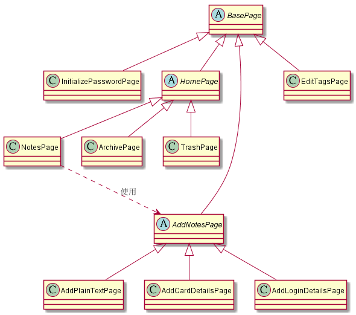

## My first Mobile App Automated Testing with Appium!  
使用Appium + python內建的unittest模組，做e2e UI自動化測試  

測試app為SealNote，是一款附有密碼鎖的記事本app  
作者原始碼Github:https://github.com/vishesh/sealnote#sealnote  

### 檔案架構  
>sealNote_pageObject.py  `-> 實做Page Object pattern`  
>test_sealNote.py  `-> 測試執行主程式`  

### UML檔  

圖中抽像類別的部分並沒有實際在程式碼中宣告與實做，只是使用上的概念是abstract
>sealNote_pageObject.puml  `-> PlantUML畫UML的檔案`  
>sealNote_pageObject.png  `-> UML圖檔`   

### 附錄:Appium環境架設
Appium的環境架設需要做的工作特別多  
網路上又一堆過時的資料，踩雷踩的特別辛苦  
將環境架設過程留個紀錄，方便以後自己看  

### 1.安裝java環境  
如果只是執行自動化測試，安裝JRE即可  
>JRE下載:https://java.com/zh_TW/download/  
>JDK下載:https://www.oracle.com/technetwork/java/javase/downloads/index.html  

### 2.安裝Android Studio  
網路上很多教學都叫你去下載SDK的壓縮包，但Android最新的開發方式已經變成使用Android Studio了  
安裝Android Studio時就會自動幫我們安裝Android SDK了  
>Android Studio下載:https://developer.android.com/studio  

傻瓜安裝即可，安裝過程可以指定SDK的安裝路徑(用預設值即可)  
預設Android SDK路徑 `C:\Users\[使用者名稱]\AppData\Local\Android\Sdk`  

### 3.安裝Appium  
由於Appium是建立NodeJS環境下啟動的所以要先安裝NodeJS (到底要安裝多少東西...)  
>NodeJS下載:https://nodejs.org/en/  

NodeJS一樣傻瓜安裝即可  
NodeJS安裝好後使用npm命令安裝Appium與appium-doctor(可以檢查appium運行環境是否OK)  
```javascript
  npm install -g appium
  npm install -g appium-doctor
```
然後去Appium官方網站下載最新的Appium桌面版  
>Appium下載:http://appium.io/  

注意，官方最新的Appium桌面版，只是方便啟動Appium的server服務  
所以上面不論是安裝NodeJS，還是使用npm命令安裝Appium都必須手動執行  
好像Appium官方舊版的exe安裝檔會幫你安裝NodeJS+Appium(不確定，反正是舊版的安裝檔了)  

安裝Appium-Client  
本自動化測試是用python執行，所以安裝python框架Client  
```javascript
  pip install Appium-Python-Client
```

### 4.設置環境變數
終於再將以下路徑加到環境變數就好了  

| 環境變數     | 值                             |
|--------------|--------------------------------|
| ANDROID_HOME | Android SDK的安裝路徑          |
| JAVA_HOME    | JDK或者JRE的安裝路徑           |
| 加到PATH     | %JAVA_HOME%\bin;               |
| 加到PATH     | %ANDROID_HOME%\tools;          |
| 加到PATH     | %ANDROID_HOME%\platform-tools; |

### 恭喜!至此終於把Appium環境架設完成ˊ_>ˋ